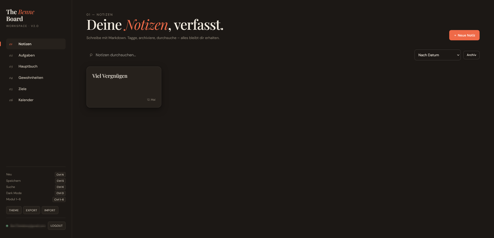
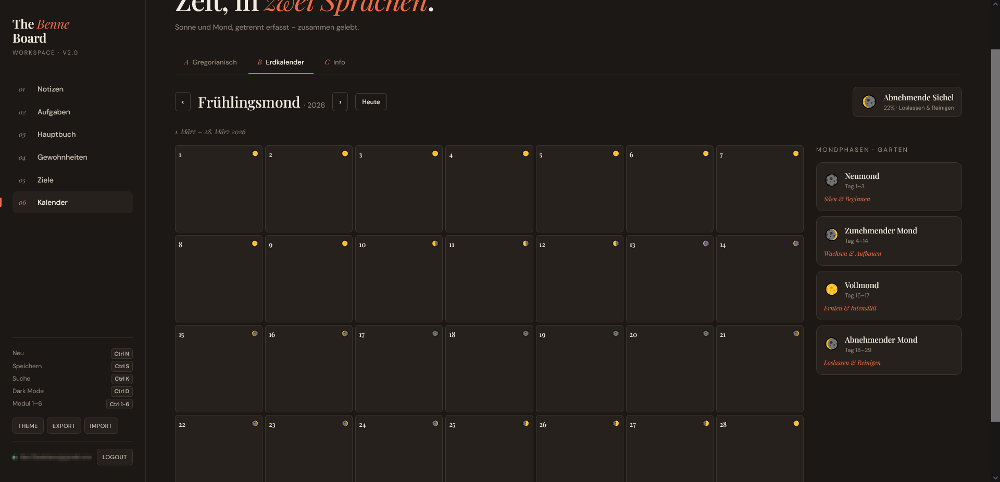

# The Benne Board

> A self-hosted, privacy-first personal workspace — notes, tasks, finances, habits, goals and a lunar calendar. All in one elegant PWA.


---

## Was ist das?

The Benne Board ist ein persönlicher All-in-One Workspace den du auf deinem eigenen Server für dich und deine Familie & Freunde hosten. Keine Cloud, keine Abos, keine fremden Server. Deine Daten bleiben bei dir.

Die App läuft als Progressive Web App (PWA) – das bedeutet sie ist im Browser nutzbar und kann auf dem Smartphone wie eine native App installiert werden. Das Backend läuft mit [PocketBase](https://pocketbase.io/) – einer Datenbank mit eingebauter Admin-UI, Auth und API.

---

## Features

### 📝 Notizen
- Erstellen, bearbeiten, archivieren
- Markdown mit Live-Preview
- Tags und Volltextsuche

### ✅ Aufgaben
- Kanban-Board (Offen / In Bearbeitung / Erledigt)
- Subtasks und Checklisten innerhalb einer Aufgabe
- Wiederkehrende Aufgaben (täglich / wöchentlich / monatlich)
- Prioritäten und Fälligkeitsdaten

### 💶 Hauptbuch
- Einnahmen und Ausgaben tracken
- Kategorien und Monatsübersicht
- Wiederkehrende Einträge (Miete, Abos)
- CSV-Export

### 🔥 Gewohnheiten
- Tägliche Habits anlegen und abhaken
- Streak-Anzeige
- Monats-Heatmap im GitHub-Stil

### 🎯 Ziele
- Ziele mit Fortschrittsbalken
- Zielwert, aktueller Wert, Einheit und Deadline
- Status: Aktiv / Erreicht / Aufgegeben

### 📅 Kalender
- Gregorianischer Kalender mit Aufgaben-Integration
- **Harmonischer Erdkalender** – 13 Monate à 28 Tage, Jahresbeginn März
- Live-Mondphasen-Berechnung nach Jean Meeus
- Mondeinfluss auf den Garten nach Mondphase (klickbare felder)
- Info-Sektion über Mond- und Sonnenkalender
 
### ⚙️ Technisch
- Single-File PWA – alles in einer `index.html`
- Offline-First mit Background-Sync
- Multi-User mit getrennten Daten
- Dark Mode (automatisch + manuell)
- Keyboard Shortcuts
- Import / Export als JSON

---

## Installation

### Was du brauchst
- Einen Server (z.B. Homeserver, Raspberry Pi, VPS)
- Docker
- Optional: [Tailscale](https://tailscale.com/) für sicheren Zugriff von überall

---

## Screenshots

| Notizen | Aufgaben | Hauptbuch | Kalender |
|--------|----------|-----------|-----------|
|  |  |  |  |

---

### Schritt 1 – PocketBase starten

```bash
docker run -d \
  --name pocketbase \
  --restart unless-stopped \
  -p 8090:8090 \
  -v /opt/pocketbase/pb_data:/pb/pb_data \
  ghcr.io/pocketbase/pocketbase \
  /pb/pocketbase serve --http=0.0.0.0:8090
```

Danach Admin-Panel aufrufen und Superuser-Account erstellen:
```
http://DEINE-IP:8090/_/
```
---

### Richtiges Beispiel


---

### Schritt 2 – Collections anlegen

Im PocketBase Admin-Panel unter **Collections** folgende Collections mit diesen Feldern anlegen:

**notes**
| Feld | Typ |
|------|-----|
| title | Text |
| content | Text |
| tags | Text |
| archived | Bool |
| user | Relation → users |

**tasks**
| Feld | Typ |
|------|-----|
| title | Text |
| description | Text |
| due_date | Date |
| priority | Text |
| status | Text |
| subtasks | JSON |
| recurring | Text |
| user | Relation → users |

**ledger_entries**
| Feld | Typ |
|------|-----|
| type | Text |
| amount | Number |
| description | Text |
| category | Text |
| date | Date |
| recurring | Text |
| user | Relation → users |

**habits**
| Feld | Typ |
|------|-----|
| name | Text |
| icon | Text |
| frequency | Text |
| target_per_week | Number |
| user | Relation → users |

**habit_logs**
| Feld | Typ |
|------|-----|
| habit | Relation → habits |
| date | Date |
| done | Bool |
| user | Relation → users |

**goals**
| Feld | Typ |
|------|-----|
| title | Text |
| description | Text |
| current_value | Number |
| target_value | Number |
| unit | Text |
| deadline | Date |
| status | Text |
| user | Relation → users |

---

### Schritt 3 – API Rules setzen

Für jede Collection im Tab **API Rules** bei allen 5 Regeln eintragen:
```
@request.auth.id != ""
```

---

### Schritt 4 – App hosten

```bash
docker run -d \
  --name benne-board \
  --restart unless-stopped \
  -p 8085:80 \
  -v /pfad/zu/index.html:/usr/share/nginx/html/index.html:ro \
  nginx:alpine
```

App aufrufen:
```
http://DEINE-IP:8085
```

---

### Schritt 5 – App konfigurieren

Beim ersten Aufruf fragt die App nach der PocketBase-URL:
```
http://DEINE-IP:8090
```

Danach kannst du dich mit deinem PocketBase-Account einloggen.

---

### Zugriff von überall mit Tailscale (empfohlen)

1. [Tailscale](https://tailscale.com/) auf Server und Gerät installieren
2. Statt der lokalen IP die Tailscale-IP verwenden – kein Port-Forwarding, kein Reverse Proxy nötig
3. PWA auf dem Smartphone installieren über „Zum Homescreen hinzufügen"

---

## User anlegen

Weitere Accounts können im PocketBase Admin-Panel unter **Users** angelegt werden. Jeder User sieht ausschließlich seine eigenen Daten.

---

## Lizenz

GPL-3.0 © [Bennedict](https://github.com/Bennedict)

---

## Autor

Gebaut von **Bennedict** & **Claude**
